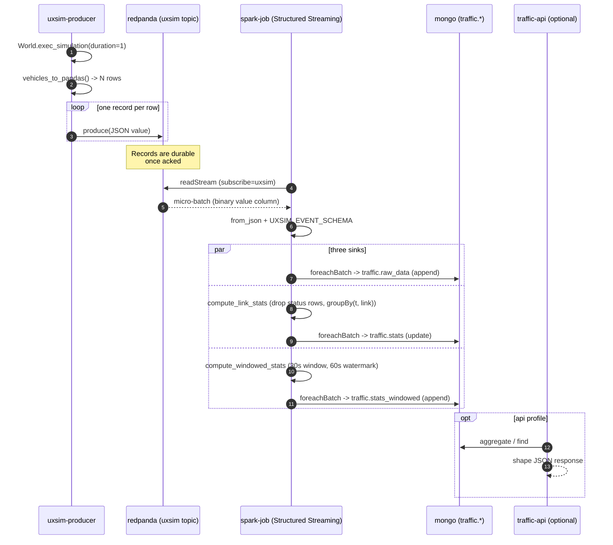

# Architecture

End-to-end description of the streaming pipeline. The system is six containers by default (plus one optional REST API container) running on a single Docker bridge network called `dsnet`.

## Component map

```
                       ┌──────────────────────────────┐
                       │           dsnet              │
                       │   (Docker bridge network)    │
                       │                              │
 ┌─────────────────┐   │   ┌──────────┐   ┌────────┐  │
 │ uxsim-producer  │─────▶│ redpanda │   │ topic- │  │
 │  (Python 3.12)  │   │   │  :9092   │◀─│  init  │  │
 └─────────────────┘   │   └────┬─────┘   └────────┘  │
                       │        │  (Kafka API)        │
                       │        ▼                     │
                       │   ┌──────────────┐           │
                       │   │ spark-master │           │
                       │   │   :7077      │           │
                       │   └──────┬───────┘           │
                       │          │                   │
                       │   ┌──────┴───────┐           │
                       │   │ spark-worker │           │
                       │   └──────┬───────┘           │
                       │          │                   │
                       │   ┌──────┴───────┐           │
                       │   │  spark-job   │           │
                       │   │ (run_consumer)           │
                       │   └──────┬───────┘           │
                       │          │  foreachBatch     │
                       │          ▼                   │
                       │     ┌─────────┐              │
                       │     │  mongo  │◀── traffic-api (api profile)
                       │     │ :27017  │              │
                       │     └─────────┘              │
                       └──────────────────────────────┘

External listeners (host machine):
  - Redpanda: localhost:19092   (host-side `rpk`, ad hoc producers)
  - MongoDB:  localhost:27018   (mongosh, Compass)
  - FastAPI:  localhost:8000    (api profile only)
```

Every service inside `dsnet` reaches every other service by its compose name. `redpanda:9092` and `localhost:19092` resolve to the same broker through two different listeners; confusing them is the single most common error when prototyping from the host.

## Tick sequence

The diagram below traces a single UXSIM simulation step (`t`) from producer to MongoDB.



## Data shapes

The Kafka payload is the JSON encoding of one row of
`World.analyzer.vehicles_to_pandas()`:

```json
{
  "name": "0",
  "dn": 5,
  "orig": "W1",
  "dest": "E4",
  "t": 1234,
  "link": "I2I1",
  "x": 312.5,
  "s": 8.0,
  "v": 11.7
}
```

`traffic.raw_data` stores each such record verbatim. `traffic.stats` stores one document per `(t, link)` with `vcount` and `vspeed`.
`traffic.stats_windowed` stores one document per `(window_start, window_end, link)` with `vcount`, `vspeed_avg`, `vspeed_min`,
`vspeed_max`. The exact column types are documented in
`src/traffic_pipeline/models/README.md`.

## Failure modes and recovery

- If `redpanda` restarts, `spark-job` reconnects on the next micro-batch attempt. Checkpoints under `/tmp/checkpoints/{raw,stats,windowed}` keep the per-query offsets, so no data is reread.
- If `mongo` restarts, the `foreachBatch` write fails for the current batch. Spark retries the batch (default behaviour). Data already written stays put thanks to the named volume `mongo_data`.
- If `uxsim-producer` finishes (it has a finite `SIMULATION_TMAX`), the rest of the stack stays up. New runs replay against an existing topic; this is a course project, not a continuously-running service.

## Deployment topology

There is one deployment target: a developer laptop running Docker Desktop. No staging, no production. The `api` Compose profile is opt-in so that the default `docker compose up -d` stays at six containers (producer, broker, topic-init, spark master, spark worker, spark job, mongo).
